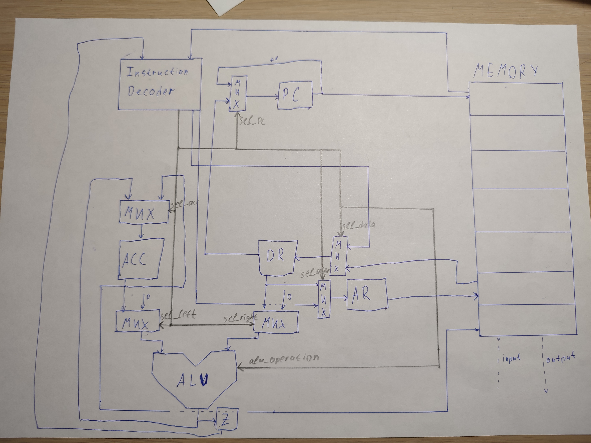

# AK-Lab3

# Asm. Транслятор и модель

- Соснило Михаил Александрович.
- `asm | acc | neum | hw | instr | struct | trap | mem | prob5`

## Язык программирования

``` ebnf
program ::= instruction

instruction ::= 
       variable
       | comment
       | command [operand]

command ::= "ADD" | "SUB" | "MUL" | "MOD" | "INC" | "ST" | "LD" | "CMP" | "JMP" | "JZ" | "JNZ" | "EI" | "HLT"

comment ::= <all symbols after ; >
```

Код выполняется последовательно. 

Язык поддерживает метки (лейблы). Можно объявлять комментарии, все что написано после спец символа `;` считается комментарием.


Код разбивается на 3 секции:

- Пользовательский обработчик прерываний (начинается с заголовка `section .interrupt` ). Если его нет, то будет использован дефолтный обработчки, просто завершающий прерываний
- Секция с переменными (начинается с заголовка `section .data` ). Переменные могут копировать значение других, либо же содержать в себе адрес другой переменной (объявляется при помощи спец символа `&`). 
- Код программы (начинается с заголовка `section .text` ). Набор команд, которые могут принимать на вход аргумент. Существует три типа аргументов:
     - Непосредственное значение (объявляется при помощи спец символа `#`)
     - Перменная (ее метка)
     - Переменная с косвенной адресацией (метка перменной с `*` в начале).
Примеры использования хорошо продемонстрированы в программе: [hello_world](src/asm/hello_world.asm)


## Организация памяти

Модель памяти процессора:

Машинное слово -- 32 бита, знаковое. Реализуется словарем: ключ - адрес (int), значение - инструкция. Одно слово -- одна ячейка

Строки, объявленные пользователем распеделяются по памяти один символ на ячейку.

```
Memory
+-----------------------------+
| 00  : input                 |
| 01  : output                |
|    ...                      |
| k   : interrupt handler     |
|    ...                      |
| n   : data                  |
|    ...                      |
| m   : program               |
|    ...                      |
+-----------------------------+
```


## Система команд

Особенности процессора:

- Машинное слово -- 32 бита, знаковое.
- Память данных:
    - адресуется через регистр `AR`;
    - может быть записана из аккумулятора `ACC`;
    - может быть прочитана в регистр `DR`.
- Алу:
    - может выолнять операции:
        - сложение
        - вычитание
        - умножение
        - получение остака от деления
    - на левый вход принимает `ACC`
    - на правый вход принимает `DR`
    - по результату операции выставялет флаг Z
- Ввод-вывод --  memory-mapped, по прерыванию. Есть 2 специальные метки STDIN и STDOUT, используемые для ввода и вывода соответственно
- `PC` -- счётчик команд:
    - инкрементируется после каждой инструкции или перезаписывается инструкцией перехода.

### Набор инструкций

| Syntax   | Mnemonic       | Кол-во тактов         | Comment                                               |
|:---------|:---------------|-----------------------|:------------------------------------------------------|
| `ADD`    | add            | 2-4                   | Складывает аккумулятор с операндом                    |
| `SUB`    | subtract       | 2-4                   | Вычитает из аккумулятора операнд                      |
| `INC`    | increment      | 2                     | Инкрементирует аккумулятор                            |
| `MUL`    | multiply       | 2-4                   | Умножает аккумулятор на операнд                       |
| `MOD`    | mod            | 2-4                   | Получает остаок от деления аккумулятора от операнда   |
| `CMP`    | compare        | 2-4                   | Сравнивает аккумулятор и операнд (выставляет флаг Z)  |
| `ST`     | store          | 2                     | Сохраняет аккумулятор в память                        |
| `LD`     | load           | 2-4                   | Загружает значение из памяти в аккумулятор            |
| `JMP`    | jump           | 1                     | Безусловный переход                                   |
| `JNZ`    | jnz            | 1                     | Переход если флаг Z == 0                              |
| `JZ`     | jz             | 1                     | Переход если флаг Z == 1                              |        
| `EI`     |end interrupt   | 8                     | Останавливает прерывание                              |
| `HLT`    | halt           | 0                     | Останавливает программу                               |

Количество тактов может зависеть от типа адресации

### Кодирование инструкций

Машинный код сериализуется в набор байтов.

## Транслятор

Интерфейс командной строки: `program_translator.py <input_file> <target_file>"`

Реализовано в модуле: [translator](src/translator/program_translator.py)

Этапы трансляции (функция `translate`):

1. Десериализация программы в input модель
2. Валидация input модели и трансляция ее во внутреннюю (проверка существования лейблов, отсутствие их дублирования, рекурсии (для перменных), трансляция лейблов в адреса и тд)
3. Сериализация в объектный файл

Правила генерации машинного кода:

- одно слово языка -- одна инструкция;
- для команд, однозначно соответствующих инструкциям -- прямое отображение;

## Модель процессора

Реализовано в модуле: [machine](src/machine/acc_machine.py).

### ControlUnit


Реализован в классе `ControlUnit`.

- Hardwired (реализовано полностью на python).
- Моделирование на уровне инструкций.
- Трансляция инструкции в последовательность сигналов: `decode_and_execute_instruction`.

Особенности работы модели:

- Для журнала состояний процессора используется стандартный модуль logging с кастомизированным форматированием.
- Остановка моделирования осуществляется при помощи исключений:
    - `EOFError` -- если нет данных для чтения из порта ввода-вывода;
    - `StopIteration` -- если выполнена инструкция `halt`.
    - `MachineException` -- рантаймовые ошибки машины (ошибка адрессации, деление на ноль и тд)
- Управление симуляцией реализовано в функции `simulate`.

## Апробация

В качестве тестов использовано два алгоритма:

1. [hello world](src/asm/hello_world.asm) -- программа выводит "Hello, world!"
2. [cat](src/asm/cat.asm) -- программа `cat`, повторяем ввод на выводе.
2. [prob5](src/asm/prob5.asm) -- проблема Эйлера, находит минимальное число, которое делится на все числа от 1 до 20

Интеграционные тесты реализованы тут: [integration_test](src/integration_test.py) в виде golden tests, конфигурация которых лежит в папке [golden](src/golden)

CI (for gitlab):

``` yaml
Test:
  stage: test
  image:
    name: python-tools
    entrypoint: [ "" ]
  script:
    - cd src
    - pip3 install --no-cache-dir -r requirements.txt
    - python3 -m pytest --verbose
    - apt install pylint
    - pylint --max-line-length=120 ./translator/deserializer.py ./utils.py ./translator/validator.py ./machine/acc_machine.py
```

CI (for github):
``` yaml
name: Test

on: [push]

jobs:
  build:
    runs-on: ubuntu-latest
    strategy:
      matrix:
        python-version: ["3.9"]
    steps:
    - uses: actions/checkout@v3
    - name: Set up Python ${{ matrix.python-version }}
      uses: actions/setup-python@v3
      with:
        python-version: ${{ matrix.python-version }}
    - name: Install dependencies
      run: |
        python -m pip install --upgrade pip
        pip install pylint
        pip install pytest-golden
    - name: Analysing the code with pylint
      run: |
        pylint --max-line-length=120 ./src/translator/deserializer.py ./src/utils.py ./src/translator/validator.py ./src/machine/acc_machine.py
    - name: Run tests
      run:
        pytest
```

где:

- `pytest` -- утилита для запуска тестов.
- `pylint` -- утилита для проверки качества кода. Некоторые правила отключены в отдельных модулях с целью упрощения кода.

Пример использования и журнал работы процессора на примере `cat`:

``` console
> cd src
> cat asm/cat.asm
section .interrupt
	LD	STDIN
	CMP	NULL_TERM
	JZ	.handle_end_symbol
	ST	STDOUT
	JMP	.end_interrupt
	.handle_end_symbol:
		LD	#0
		ST	CHECK_END
		
		.end_interrupt:
			EI

section .data
	NULL_TERM: 10
	CHECK_END: 1
	
section .text
.start:
		LD	#0	
		.loop:
			CMP	CHECK_END
			JNZ	.loop
		.end:
			HLT
> cat input/interrupt.json 
[
    {"tick": 1, "char": "f"},
    {"tick": 2, "char": "o"},
    {"tick": 6, "char": "o"},
    {"tick": 45, "char": "\n"}
]

> ./translator/program_translator.py asm/cat.asm target.out
Program successfully translated!
LoC: 22
Code: 14
> ./machine/acc_machine.py target.out examples/interrupt.json
Machine - DEBUG - {TICK: 0, PC: 102, AR: 0, DR: 0, ACC: 0, Z: False} LD ArgType.VAL 0
Machine - DEBUG - {TICK: 3, PC: 103, AR: 0, DR: 0, ACC: 0, Z: True} CMP ArgType.ADDR 101
Machine - DEBUG - Interrupt TICK: {3}
Machine - DEBUG - 0 -> MEM(90)
Machine - DEBUG - 1 -> MEM(91)
Machine - DEBUG - 103 -> MEM(92)
Machine - DEBUG - input -> f
Machine - DEBUG - {TICK: 15, PC: 11, AR: 0, DR: 102, ACC: 102, Z: False} CMP ArgType.ADDR 100
Machine - DEBUG - {TICK: 19, PC: 12, AR: 100, DR: 10, ACC: 102, Z: False} JZ ArgType.VAL 15
Machine - DEBUG - {TICK: 20, PC: 13, AR: 100, DR: 10, ACC: 102, Z: False} ST ArgType.STDOUT 1
Machine - DEBUG - f -> output
Machine - DEBUG - {TICK: 23, PC: 14, AR: 1, DR: 10, ACC: 102, Z: False} JMP ArgType.VAL 17
Machine - DEBUG - {TICK: 25, PC: 17, AR: 1, DR: 17, ACC: 102, Z: False} EI  --   -- 
Machine - DEBUG - Interrupt end!
Machine - DEBUG - {TICK: 34, PC: 103, AR: 90, DR: 0, ACC: 0, Z: True} CMP ArgType.ADDR 101
Machine - DEBUG - Interrupt TICK: {34}
Machine - DEBUG - 0 -> MEM(90)
Machine - DEBUG - 1 -> MEM(91)
Machine - DEBUG - 103 -> MEM(92)
Machine - DEBUG - input -> o
Machine - DEBUG - {TICK: 46, PC: 11, AR: 0, DR: 111, ACC: 111, Z: False} CMP ArgType.ADDR 100
Machine - DEBUG - {TICK: 50, PC: 12, AR: 100, DR: 10, ACC: 111, Z: False} JZ ArgType.VAL 15
Machine - DEBUG - {TICK: 51, PC: 13, AR: 100, DR: 10, ACC: 111, Z: False} ST ArgType.STDOUT 1
Machine - DEBUG - o -> output
Machine - DEBUG - {TICK: 54, PC: 14, AR: 1, DR: 10, ACC: 111, Z: False} JMP ArgType.VAL 17
Machine - DEBUG - {TICK: 56, PC: 17, AR: 1, DR: 17, ACC: 111, Z: False} EI  --   -- 
Machine - DEBUG - Interrupt end!
Machine - DEBUG - {TICK: 65, PC: 103, AR: 90, DR: 0, ACC: 0, Z: True} CMP ArgType.ADDR 101
Machine - DEBUG - Interrupt TICK: {65}
Machine - DEBUG - 0 -> MEM(90)
Machine - DEBUG - 1 -> MEM(91)
Machine - DEBUG - 103 -> MEM(92)
Machine - DEBUG - input -> o
Machine - DEBUG - {TICK: 77, PC: 11, AR: 0, DR: 111, ACC: 111, Z: False} CMP ArgType.ADDR 100
Machine - DEBUG - {TICK: 81, PC: 12, AR: 100, DR: 10, ACC: 111, Z: False} JZ ArgType.VAL 15
Machine - DEBUG - {TICK: 82, PC: 13, AR: 100, DR: 10, ACC: 111, Z: False} ST ArgType.STDOUT 1
Machine - DEBUG - o -> output
Machine - DEBUG - {TICK: 85, PC: 14, AR: 1, DR: 10, ACC: 111, Z: False} JMP ArgType.VAL 17
Machine - DEBUG - {TICK: 87, PC: 17, AR: 1, DR: 17, ACC: 111, Z: False} EI  --   -- 
Machine - DEBUG - Interrupt end!
Machine - DEBUG - {TICK: 96, PC: 103, AR: 90, DR: 0, ACC: 0, Z: True} CMP ArgType.ADDR 101
Machine - DEBUG - Interrupt TICK: {96}
Machine - DEBUG - 0 -> MEM(90)
Machine - DEBUG - 1 -> MEM(91)
Machine - DEBUG - 103 -> MEM(92)

Machine - DEBUG - {TICK: 108, PC: 11, AR: 0, DR: 10, ACC: 10, Z: False} CMP ArgType.ADDR 100
Machine - DEBUG - {TICK: 112, PC: 12, AR: 100, DR: 10, ACC: 10, Z: True} JZ ArgType.VAL 15
Machine - DEBUG - {TICK: 114, PC: 15, AR: 100, DR: 15, ACC: 10, Z: True} LD ArgType.VAL 0
Machine - DEBUG - {TICK: 117, PC: 16, AR: 100, DR: 0, ACC: 0, Z: True} ST ArgType.ADDR 101
Machine - DEBUG - 0 -> MEM(101)
Machine - DEBUG - {TICK: 120, PC: 17, AR: 101, DR: 0, ACC: 0, Z: True} EI  --   -- 
Machine - DEBUG - Interrupt end!
Machine - DEBUG - {TICK: 129, PC: 103, AR: 90, DR: 0, ACC: 0, Z: True} CMP ArgType.ADDR 101
Machine - DEBUG - {TICK: 133, PC: 104, AR: 101, DR: 0, ACC: 0, Z: True} JNZ ArgType.VAL 103
Machine - DEBUG - {TICK: 134, PC: 105, AR: 101, DR: 0, ACC: 0, Z: True} HLT  --   -- 
Output: foo
Instructions: 28
Ticks: 135
```

| ФИО           | алг.  | LoC       | code байт | code инстр.  | инстр. | такт. | вариант |
|---------------|-------|-----------|-----------|--------------|--------|-------|---------|
| Соснило М.А.  | hello | 14        | -         | 25           | 112    | 419   | ...     |
| Соснило М.А.  | cat   | 22        | -         | 14           | 28     | 135   | ...     |
| Соснило М.А.  | prob5 | 28        | -         | 23           | 2730   | 8171  | ...     |

